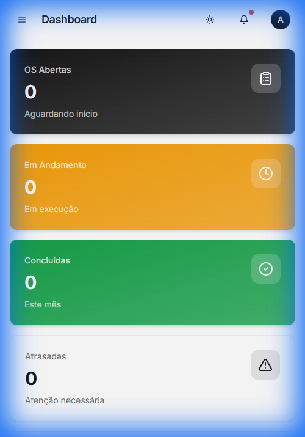
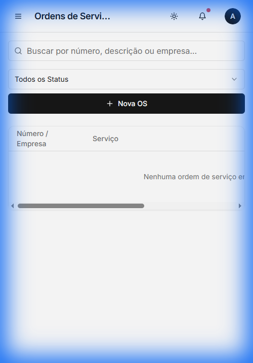
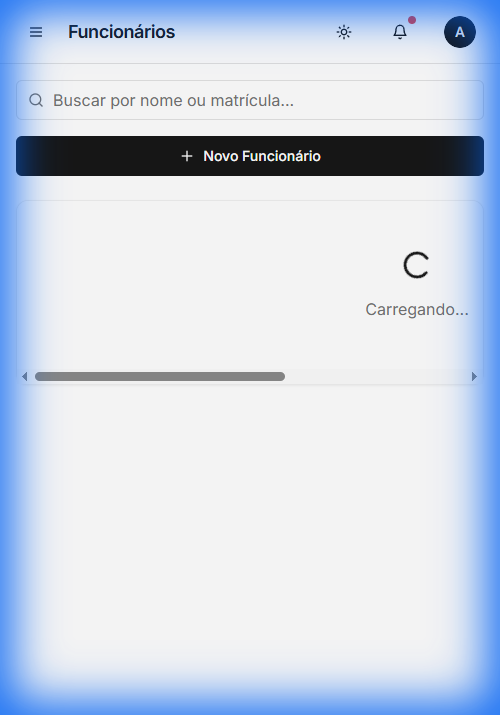

# 🛠️ OSM - Gestor de Ordens de Serviço



## 📌 Sobre o Projeto

O **OSM (Order Service Manager)** é uma solução robusta e moderna para a gestão completa de ordens de serviço, empresas parceiras e colaboradores. Desenvolvido com foco na experiência do usuário (UX) e eficiência operacional, o sistema permite o acompanhamento em tempo real do status das atividades, gestão de especialidades e visualização analítica através de dashboards intuitivos.

Este projeto foi construído utilizando as tecnologias mais modernas do ecossistema React, garantindo alta performance, escalabilidade e uma interface extremamente refinada.

---

## 📸 Demonstração

### Visão Geral (Dashboard)

Painel administrativo com métricas cruciais para a tomada de decisão.


### Gestão de Ordens de Serviço

Interface dinâmica para criação, edição e acompanhamento de fluxos de trabalho.


### Controle de Colaboradores & Empresas

Gestão centralizada de talentos e parceiros comerciais.

| Funcionários | Empresas |
| :---: | :---: |
|  |  |

---

## 🚀 Principais Funcionalidades

- **📊 Dashboard Inteligente**: Visualização de métricas de OS, status de execução e produtividade.
- **📝 Gestão de OS**: Fluxo completo de ordens de serviço com atribuição de responsáveis e prazos.
- **👥 Cadastro de Colaboradores**: Controle de especialidades, cargos e status operacional.
- **🏢 Gestão de Empresas**: Base de dados de parceiros e clientes.
- **⚙️ Configurações Customizáveis**: Ajustes de perfil e preferências do sistema.
- **🔐 Autenticação Segura**: Fluxo de login integrado via Supabase.

---

## 🛠️ Stack Tecnológica

- **Frontend**: [React](https://reactjs.org/) + [TypeScript](https://www.typescriptlang.org/)
- **Build Tool**: [Vite](https://vitejs.dev/)
- **Estilização**: [Tailwind CSS](https://tailwindcss.com/)
- **Componentes UI**: [Shadcn/UI](https://ui.shadcn.com/) + [Radix UI](https://www.radix-ui.com/)
- **Backend & Auth**: [Supabase](https://supabase.com/)
- **Gerenciamento de Estado**: [TanStack Query (React Query)](https://tanstack.com/query/latest)
- **Formulários**: [React Hook Form](https://react-hook-form.com/) + [Zod](https://zod.dev/)
- **Animações**: [Framer Motion](https://www.framer.com/motion/)
- **Gráficos**: [Recharts](https://recharts.org/)

---

## 📦 Como Executar o Projeto

1. **Clone o repositório:**

   ```bash
   git clone https://github.com/seu-usuario/OSM-os-manager.git
   cd OSM-os-manager
   ```

2. **Instale as dependências:**

   ```bash
   npm install
   ```

3. **Configure as variáveis de ambiente:**
   Crie um arquivo `.env` na raiz do projeto com suas credenciais do Supabase:

   ```env
   VITE_SUPABASE_URL=sua_url_do_supabase
   VITE_SUPABASE_ANON_KEY=sua_chave_anon_do_supabase
   ```

4. **Inicie o servidor de desenvolvimento:**

   ```bash
   npm run dev
   ```

   Acesse: `http://localhost:8080`

---

## 📂 Estrutura de Pastas

```
src/
├── components/   # Componentes reutilizáveis (UI & Layout)
├── data/         # Mock data e constantes
├── hooks/        # Hooks customizados
├── lib/          # Configurações de bibliotecas (Supabase, Utils)
├── pages/        # Telas principais da aplicação
├── types/        # Definições de tipos TypeScript
└── App.tsx       # Configuração de rotas e providers
```

---

## 📝 Licença

Este projeto está sob a licença [MIT](LICENSE).

---

<p align="center">
  Desenvolvido com ❤️ por <strong>Robson Ferreira</strong>
</p>
